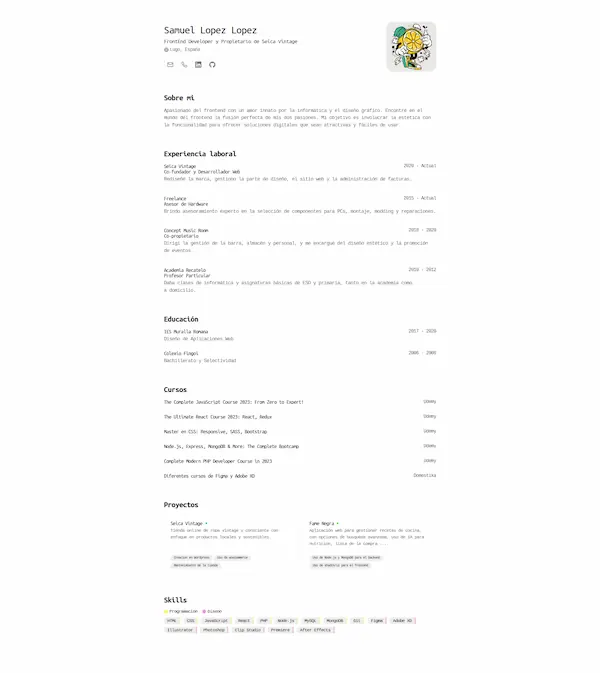

<div align="center">

<h2>
    <em>Caurriculum</em> minimalista maquetado para web y para imprimir.
</h2>
<p>
Esquema del JSON de CV de <a href="https://jsonresume.org/schema/">jsonresume.org</a>
</p>

<p>
Creado siguiendo tutorial de <a href="https://midu.dev">Midudev</a>
Basado en el diseño de <a href="https://github.com/BartoszJarocki/cv">Bartosz Jarocki</a>

</p>

</div>

<div align="center">
    <a href="#empezar">
        Empezar
    </a>
    <span>&nbsp;✦&nbsp;</span>
    <a href="#comandos">
        Comandos
    </a>
   
</div>

<p></p>

<div align="center">


</div>

</img>

## Stack

- [**Astro**](https://astro.build/) - El framework web de la nueva época.
- [**Typescript**](https://www.typescriptlang.org/) - JavaScript con sintaxis de tipado.
- [**HotKeyPad**](https://github.com/jesubohr/hotkeypad) - Menu desplegable con atajos de teclado.

## Empezar

### 1. Usa este [repo](https://github.com/samU13/course-portofolio) como _template_ de un proyecto de Astro

- Usa [pnpm](https://pnpm.io/installation) como gestor de dependencias y empaquetador.

```bash
# Activa pnpm en MacOS, WSL & Linux:
corepack enable
corepack prepare pnpm@latest --activate

# Inicializa el proyecto
pnpm create astro@latest -- --template midudev/minimalist-portfolio-json
```

### 2. Añade tu contenido:

Edita el archivo `cv.json` para crear tu propio Portafolio/CV imprimible.

### 3. Lanza el servidor de desarrollo:

```bash
# Disfruta del resultado
pnpm dev
```

1. Abre [**http://localhost:4321**](http://localhost:4321/) en tu navegador para ver el resultado 🚀

## Comandos

| Comando         | Acción                                                                       |
| :-------------- | :--------------------------------------------------------------------------- |
| `dev` o `start` | Lanza un servidor de desarrollo local en `localhost:4321`.                   |
| `build`         | Comprueba posibles errores y hace un empaquetado de producción en `./dist/`. |
| `preview`       | Vista previa en local `localhost:4321`                                       |
